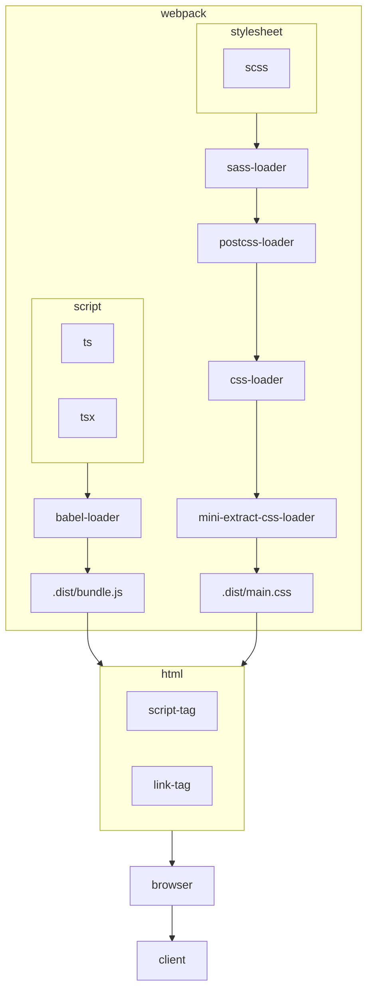

# Room Service Pre Exam

## Table of Contents

- [Room Service Pre Exam](#room-service-pre-exam)
  - [Table of Contents](#table-of-contents)
  - [Prerequisites](#prerequisites)
  - [Getting Started](#getting-started)
    - [Clone the repository](#clone-the-repository)
    - [Install dependencies](#install-dependencies)
    - [Run the application](#run-the-application)
      - [Build the application](#build-the-application)
        - [development build](#development-build)
        - [production build](#production-build)
  - [Storybook](#storybook)

## Demo Links

- [Demo](https://room-service-seven.vercel.app/)
- [Storybook](https://room-service-storybook.vercel.app/)
- [Github](https://github.com/guychienll/room-service)


## Architecture



## Prerequisites

| Dependency | Version          |
| ---------- | ---------------- |
| node       | v18.17 or higher |
| npm        | v9.6.7 or higher |

## Getting Started

### Clone the repository

```shell
git clone
```

### Install dependencies

```shell
npm install
```

### Run the application

Development watch mode would be run on https://localhost:3000

```shell
npm run dev
```

#### Build the application

##### development build

```shell
npm run build:dev
```

##### production build

```shell
npm run build:prod
```

> difference between development build
>
> - minify
> - uglify

## Storybook

```shell
npm run storybook
```
