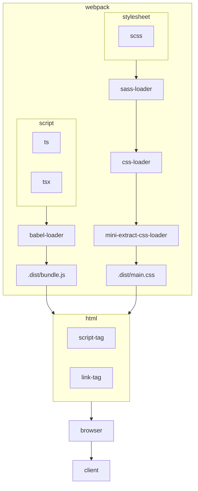

# Room Service Pre Exam



## Prerequisites

| Dependency | Version          |
|------------|------------------|
| node       | v18.17 or higher |
| npm        | v9.6.7 or higher |

## Getting Started

### Clone the repository

```shell
git clone 
```

### Install dependencies

```shell
npm install
```

### Run the application

Development watch mode would be run on https://localhost:3000

```shell
npm run dev
```

#### Build the application

##### development build

```shell
npm run build:dev
```

##### production build

```shell
npm run build:prod
```

> difference between development build 
> - minify
> - uglify

